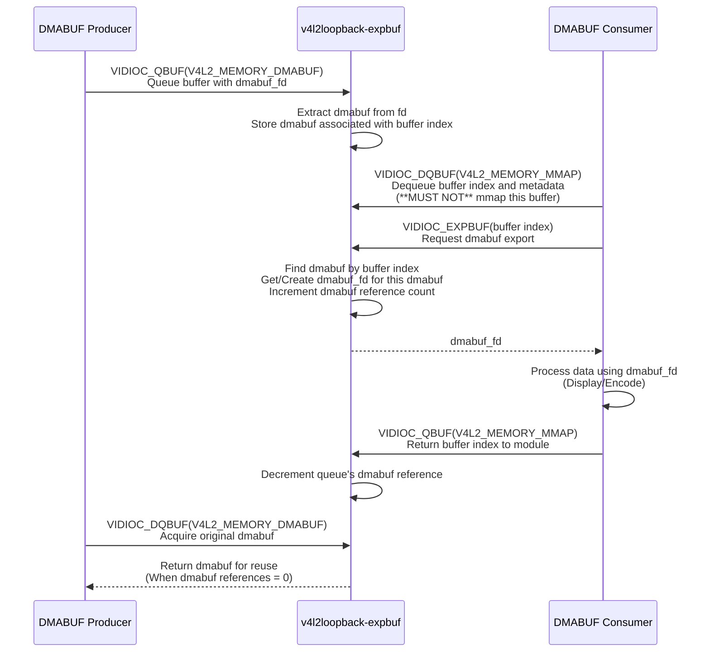
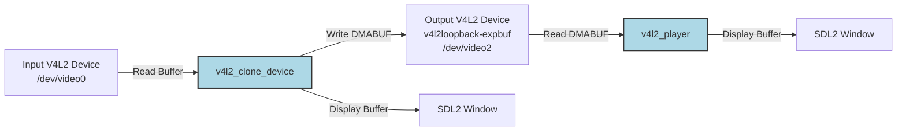

# v4l2loopback and DMABUF

This document describes the video data flow on Linux using the `v4l2loopback` kernel module, leveraging DMABUF for efficient buffer sharing between the DMABUF producer (`v4l2_clone_device`) and the DMABUF consumer (`v4l2_player`).

## v4l2loopback-expbuf (Experimental DMABUF Support)

[`v4l2loopback-expbuf`](https://github.com/daijh/v4l2loopback) is an **experimental** modified version of the original [`v4l2loopback`](https://github.com/v4l2loopback/v4l2loopback) kernel module. This fork adds support for the [`VIDIOC_EXPBUF`](https://www.kernel.org/doc/html/latest/userspace-api/media/v4l/vidioc-expbuf.html#ioctl-vidioc-expbuf)ioctl, allowing V4L2 buffers to be exported as DMABUF file descriptors for efficient zero-copy buffer sharing between user-space applications.

Many thanks to the original `v4l2loopback` authors for their foundational work.

## DMABUF Buffer Flow Sequence



## Demonstration Setup

This demo uses two example applications from the [`v4l2_camera`](https://github.com/daijh/v4l2_camera) repository: `v4l2_clone_device` and `v4l2_player`.

`v4l2_clone_device`: Reads frames from an input V4L2 device (e.g., /dev/video0), acts as the DMABUF producer, copies content into DMABUF buffers, and queues them to the `v4l2loopback-expbuf` device. It can optionally display the frames it reads.

`v4l2_player`: Acts as the DMABUF consumer, dequeues buffers from the `v4l2loopback-expbuf` device (e.g., /dev/video2), exports them as DMABUF file descriptors, and uses these to access and display the video stream.

The data flow is as follows:



## Build `v4l2loopback-expbuf`

1. **Clone the repository:**

    ```shell
    git clone https://github.com/daijh/v4l2loopback.git -b expbuf-dmabuf v4l2loopback-expbuf
    cd v4l2loopback-expbuf
    ```

2. **Build the kernel module:**

    ```shell
    make
    ```

## Build Applications

Instructions for building the `v4l2_clone_device` and `v4l2_player` applications can be found in the `v4l2_camera` repository:

See [`v4l2_camera`](https://github.com/daijh/v4l2_camera) build instructions.

## Run

Follow these steps to run the DMABUF demo:

1. **Load the `v4l2loopback-expbuf` module:**

    ```shell
    cd v4l2loopback-expbuf

    echo "Attempting to remove v4l2loopback module..."
    sudo rmmod -v -f v4l2loopback

    # Set debug=3 to enable verbose driver logging
    echo "Attempting to load v4l2loopback module with parameters..."
    sudo insmod ./v4l2loopback.ko \
        devices=1 \
        exclusive_caps=1 \
        min_buffers=10 \
        max_buffers=16 \
        support_dmabuf=1 \
        card_label="v4l2loopback-expbuf" \
        debug=1

    echo "Verifying v4l2loopback module is loaded..."
    lsmod | grep ^v4l2loopback

    echo "Listing v4l2loopback devices (if created):"
    v4l2-ctl --list-devices | grep "v4l2loopback" -A 2
    ```

2. **Run the DMABUF Producer (`v4l2_clone_device`):**

    ```shell
    # Assume the v4l2loopback-expbuf device is /dev/video2
    ./v4l2_clone_device -i /dev/video0 -o /dev/video2 --width 640 --height 360 --dmabuf
    ```

3. **Run the DMABUF Consumer (`v4l2_player`):**

    ```shell
    ./v4l2_player -i /dev/video2 --width 640 --height 360 --dmabuf
    ```
