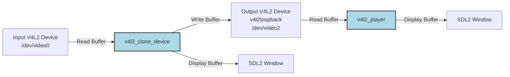

# v4l2_clone_device

A C++ command-line application to capture video from one V4L2 device and output it to another. Optional SDL2 rendering is also supported.

This tool reads frames from a V4L2 input device (e.g., /dev/video0) and writes them to a V4L2 output device (e.g., /dev/video2). The output device is typically a virtual device created using the **[`v4l2loopback`](https://github.com/umlaeute/v4l2loopback)** kernel module. The video streamed to the output device can then be consumed by `v4l2_player`.



## Features

* Captures video from a specified V4L2 input device (e.g., /dev/video0).
* Outputs video frames to a specified V4L2 output device (e.g., /dev/video2).
* Configurable capture and output resolution (width and height).
* Supports YUYV pixel format for capture and output.
* Optional rendering of captured frames in an SDL2 window.
* Option to use DMABUF for buffer handling between capture and output devices.

## Usage

```shell
# Help
./v4l2_clone_device -h

Usage:
  ./v4l2_clone_device [OPTION...]

  -h, --help        Print help
  -i, --input arg   Specify capture device (default: /dev/video0)
      --width arg   Specify capture video width (default: 640)
      --height arg  Specify capture video height (default: 360)
  -o, --output arg  Specify output device (default: /dev/video2)
      --dmabuf      Use DMABUF for output device enqueuing (default: false)
      --not_show    Do not Show capture stream

# Clone /dev/video0 to /dev/video2
./v4l2_clone_device -i /dev/video0 -o /dev/video2 --width 640 --height 360

# Disable showing capture stream
./v4l2_clone_device -i /dev/video0 -o /dev/video2 --width 640 --height 360 --not_show

# Enable DMABUF for V4L2 output device enqueuing
./v4l2_clone_device -i /dev/video0 -o /dev/video2 --width 640 --height 360 --dmabuf
```
